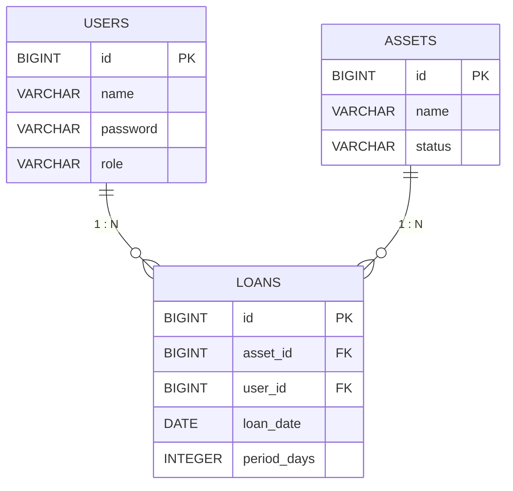

# システム概要

## 1. プロジェクト基本情報
- **プロジェクト名**: asset-management
- **説明**: Asset Management Training App
- **バージョン**: 0.0.1-SNAPSHOT

## 2. 技術スタック

### 2.1 開発言語・フレームワーク
- **言語**: Java 21
- **フレームワーク**: Spring Boot 3.3.0
- **ビルドツール**: Maven

### 2.2 データアクセス層
- **ORM**: Spring Data JPA
- **データベース (開発環境)**: H2 Database (Runtime scope)
- **データベース (本番/演習環境)**: PostgreSQL

### 2.3 プレゼンテーション層
- **Webフレームワーク**: Spring Web MVC
- **テンプレートエンジン**: Thymeleaf

### 2.4 開発支援・ユーティリティ
- **コード簡略化**: Lombok (Optional)
- **開発ツール**: Spring Boot DevTools (Runtime scope)
- **テスト**: Spring Boot Starter Test

## 3. 機能一覧

### 3.1 認証機能 (LoginController)
- **概要**: ユーザー認証とセッション管理を行います。
- **詳細**:
  - ログイン処理（ユーザー名による簡易認証）
  - 未ログインユーザーのアクセス制限
  - ログアウト処理

### 3.2 資産管理機能 (AssetController)
- **概要**: PCやタブレットなどの資産情報の登録・参照を行います。
- **詳細**:
  - 資産一覧の表示
  - 新規資産の登録
  - 資産ステータス管理（AVAILABLE:利用可能 / LOANED:貸出中）

### 3.3 貸出管理機能 (LoanController)
- **概要**: 資産の貸出および返却のトランザクションを管理します。
- **詳細**:
  - 資産の貸出登録（貸出中の資産は再貸出不可）
  - 資産の返却処理

### 3.4 ユーザー管理機能 (UserController)
- **概要**: システム利用者のユーザー管理を行います。
- **詳細**:
  - ユーザー一覧表示
  - 新規ユーザー登録
  - ユーザー削除（貸出中の資産があるユーザーは削除不可）

## 4. データモデル

### 4.1 ER図

### 4.2 テーブル詳細

- **USERS**: システム利用者情報。`role` カラムで権限管理（例: ADMIN, USER）を想定。
- **ASSETS**: 管理対象の資産情報。`status` で貸出可否（AVAILABLE/LOANED）を管理。
- **LOANS**: 貸出履歴・状態を管理する中間テーブル。ユーザーと資産を紐付ける。

## 5. 初期データ仕様 (data.sql)

アプリケーション起動時に投入される開発・テスト用データです。

### 5.1 ユーザー (USERS)

| ID | 名前 | パスワード | 権限 (Role) | 備考 |
| :--- | :--- | :--- | :--- | :--- |
| 1 | Admin | a123 | ADMIN | 管理者アカウント |
| 2 | Alice | a123 | ADMIN | 管理者アカウント |
| 3 | Bob | b456 | USER | 一般ユーザー |
| 4 | Charlie | c789 | USER | 一般ユーザー |
| 5 | Taro | (空) | USER | パスワードなしテスト用 |

### 5.2 資産 (ASSETS)

| ID | 資産名 | 初期ステータス |
| :--- | :--- | :--- |
| 1 | MacBook Pro | LOANED (貸出中) |
| 2 | iPad Air | LOANED (貸出中) |
| 3 | Dell Monitor 24inch | AVAILABLE (利用可能) |
| 4 | iPhone 15 | AVAILABLE (利用可能) |
| 5 | Web Camera | LOANED (貸出中) |

### 5.3 貸出履歴 (LOANS)

| 資産ID | ユーザーID | 貸出日 | 期間(日) | テスト目的 |
| :--- | :--- | :--- | :--- | :--- |
| 1 (MacBook) | 1 (Admin) | 2026-03-20 | 7 | 通常貸出 |
| 2 (iPad) | 2 (Alice) | 2026-03-01 | 7 | **期限切れ** (遅延テスト用) |
| 5 (WebCam) | 3 (Bob) | 2026-03-21 | 14 | 直近の貸出 |