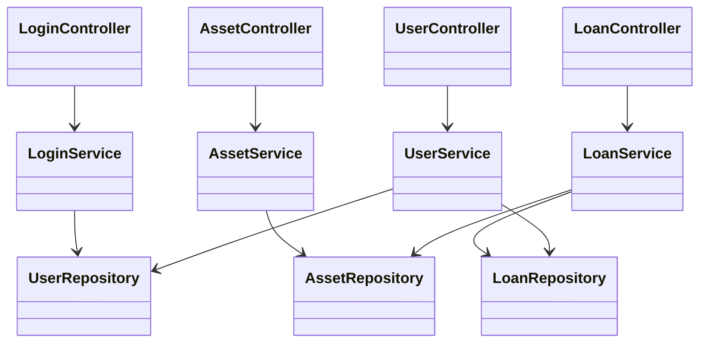

# クラス設計書

## 1. パッケージ構成

ベースパッケージ: `com.example.demo`

| パッケージ名 | 役割 | 主なクラス |
| :--- | :--- | :--- |
| `.controller` | 画面遷移、リクエスト受付 | `*Controller` |
| `.service` | 業務ロジック、トランザクション管理 | `*Service` |
| `.repository` | データベースアクセス (JPA) | `*Repository` |
| `.entity` | データベースのテーブル定義 | `User`, `Asset`, `Loan` |

## 2. クラス図 (依存関係)

## 3. クラス詳細

### 3.1 Controller層

- **LoginController**: ログイン認証、ログアウト、メニュー画面への遷移を制御する。`HttpSession` を利用してログイン状態を管理する。
- **AssetController**: 資産一覧画面の表示、新規資産登録の受付を行う。
- **LoanController**: 貸出・返却処理の受付を行う。貸出時には `AssetService` から取得した資産リストを画面に渡す。
- **UserController**: ユーザー管理画面の表示、登録、削除リクエストを処理する。

### 3.2 Service層

- **LoginService**
  - `authenticate(name, password)`: ユーザー名とパスワードの一致確認を行う。

- **AssetService**
  - `findAll()`: 全資産を取得する。
  - `save(asset)`: 資産を登録する（初期ステータス設定含む）。

- **LoanService**
  - `findAll()`: 貸出履歴を全件取得する。
  - `loan(assetId, userId, ...)`: **トランザクション処理**。`Loan` テーブルへの登録と `Asset` テーブルのステータス更新(`LOANED`)を原子的に行う。
  - `returnAsset(loanId)`: **トランザクション処理**。`Asset` ステータスを `AVAILABLE` に戻し、貸出情報を更新/削除する。

- **UserService**
  - `findAll()`: 全ユーザーを取得する。
  - `save(user)`: ユーザーを登録する。
  - `delete(id)`: ユーザー削除を行う。削除前に `LoanRepository` を確認し、貸出中の資産がある場合は例外をスローして削除を中断する。

### 3.3 Entity層

- **User**
  - `id` (Long), `name` (String), `password` (String), `role` (String)
  - ユーザー情報を保持する。

- **Asset**
  - `id` (Long), `name` (String), `status` (String)
  - ステータスは "AVAILABLE" または "LOANED" をとる。

- **Loan**
  - `id` (Long), `asset` (Asset), `user` (User), `loanDate` (Date), `periodDays` (Integer)
  - 資産とユーザーの関連付け（中間テーブル的な役割）を持つ。