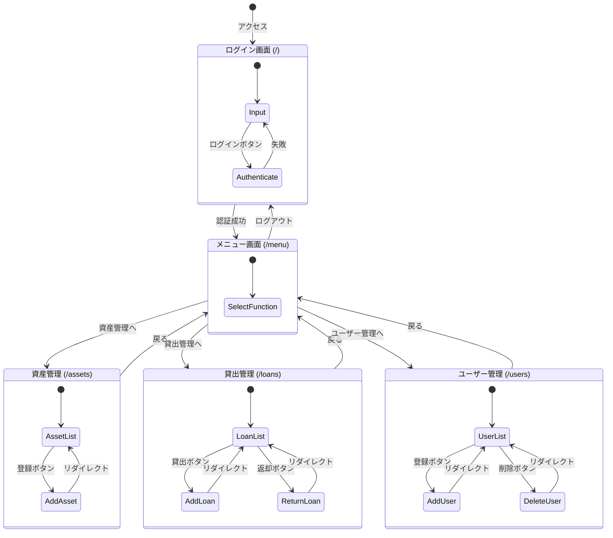

# 画面遷移図

## 1. 全体フロー

## 2. 画面詳細

| 画面名 | URL | 主なアクション | 遷移先 |
| :--- | :--- | :--- | :--- |
| **ログイン** | `/` | ログイン | 成功: メニュー 失敗: 自画面 |
| **メニュー** | `/menu` | 機能選択 ログアウト | 各機能画面 ログイン画面 |
| **資産一覧** | `/assets` | 新規登録 戻る | 自画面 (更新) メニュー |
| **貸出管理** | `/loans` | 貸出登録 返却 戻る | 自画面 (更新) 自画面 (更新) メニュー |
| **ユーザー管理** | `/users` | ユーザー登録 削除 戻る | 自画面 (更新) 自画面 (更新) メニュー |