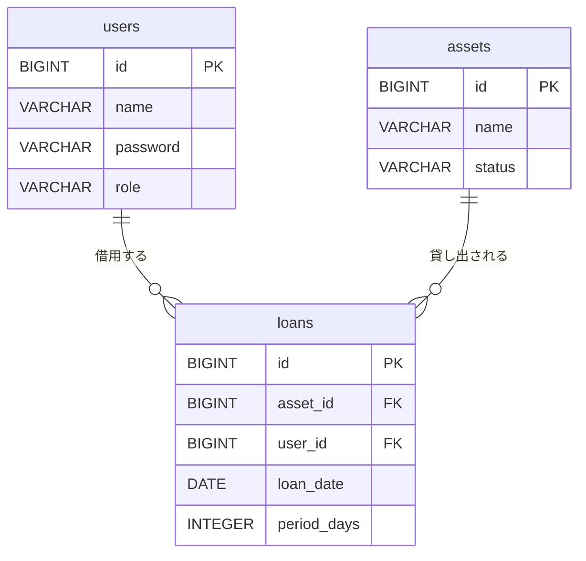

# データベース設計書

## 1. ER図

## 2. テーブル定義

### 2.1 users (ユーザー)

システムを利用するユーザー情報を管理します。

| 論理名 | 物理名 | 型 | 制約 / 備考 |
| :--- | :--- | :--- | :--- |
| ユーザーID | id | BIGINT | **PK**, Auto Increment |
| ユーザー名 | name | VARCHAR(100) | |
| パスワード | password | VARCHAR(100) | |
| 権限 | role | VARCHAR(20) | `ADMIN` (管理者), `USER` (一般) |

### 2.2 assets (資産)

貸出対象となる資産（PC、備品など）を管理します。

| 論理名 | 物理名 | 型 | 制約 / 備考 |
| :--- | :--- | :--- | :--- |
| 資産ID | id | BIGINT | **PK**, Auto Increment |
| 資産名 | name | VARCHAR(100) | |
| ステータス | status | VARCHAR(20) | `AVAILABLE` (利用可), `LOANED` (貸出中) |

### 2.3 loans (貸出履歴)

誰がどの資産をいつから借りているかを管理するトランザクションテーブルです。

| 論理名 | 物理名 | 型 | 制約 / 備考 |
| :--- | :--- | :--- | :--- |
| 貸出ID | id | BIGINT | **PK**, Auto Increment |
| 資産ID | asset_id | BIGINT | **FK** (Ref: assets.id) |
| ユーザーID | user_id | BIGINT | **FK** (Ref: users.id) |
| 貸出日 | loan_date | DATE | |
| 貸出期間 | period_days | INTEGER | 貸出日数 |