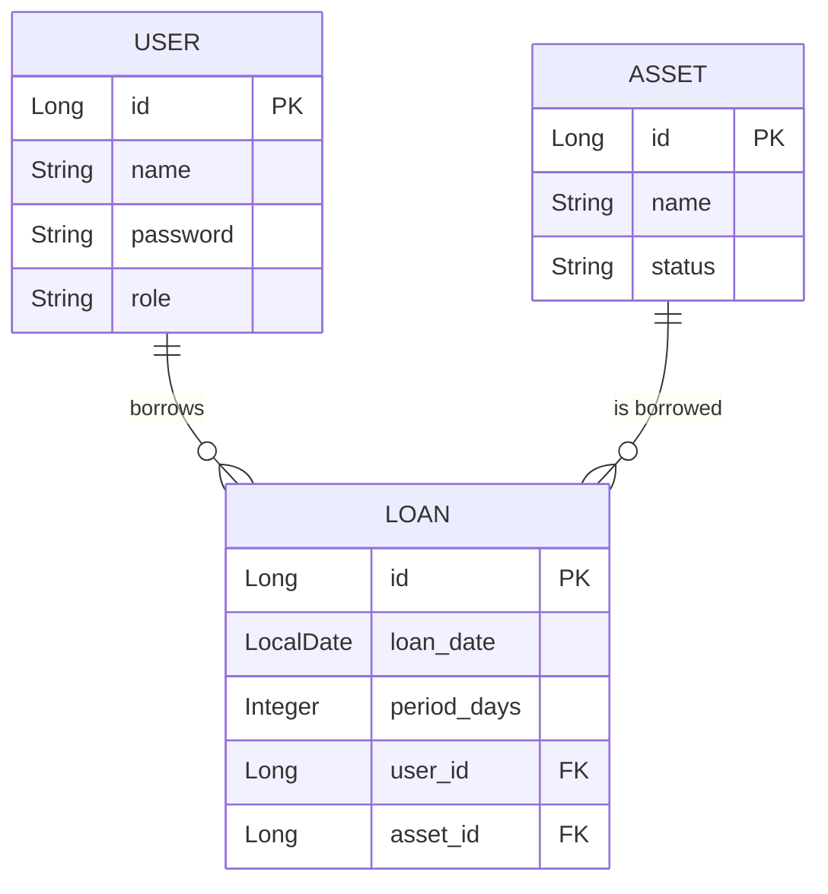

# クラス設計

## Controller
各画面からのリクエストを受け取り、Serviceを呼び出して結果をViewに返す役割を担う。

| クラス | 主な役割 |
|---|---|
| `LoginController` | ログイン・ログアウト処理 |
| `MenuController` | メニュー画面の表示 |
| `AssetController` | 資産の表示・登録 |
| `LoanController` | 貸出・返却処理 |
| `UserController` | ユーザの表示・登録・削除・権限変更 |

---

## Service
ドメインロジック（業務処理）を担当する。Controllerから呼び出され、必要に応じてRepositoryを通じてデータ永続化を行う。

| クラス | 主な役割 |
|---|---|
| `LoginService` | ユーザ認証に関する処理 |
| `AssetService` | 資産情報の取得・登録 |
| `LoanService` | 資産の貸出・返却に関する処理 |

---

## Entity
データベースのテーブルとマッピングされるオブジェクト。

| クラス | フィールド | 説明 |
|---|---|---|
| `User` | `id`, `name`, `password`, `role` | ユーザ情報 |
| `Asset` | `id`, `name`, `status`, `loans` | 資産情報 |
| `Loan` | `id`, `loan_date`, `period_days`, `asset`, `user` | 貸出情報 |

---

## Repository
Spring Data JPA によって、データベースへのアクセスを担うインターフェース。

| インターフェース | 対応エンティティ |
|---|---|
| `UserRepository` | `User` |
| `AssetRepository` | `Asset` |
| `LoanRepository` | `Loan` |

---

## Entity関係図

- 1人のユーザは複数の貸出情報を持つことができる (`USER` 1 -- n `LOAN`)
- 1つの資産は複数の貸出情報を持つことができる (`ASSET` 1 -- n `LOAN`)
  - ※ただし、アプリケーションのロジック上、同時に複数の貸出（`status`が`LOANED`）を持つことはない。
