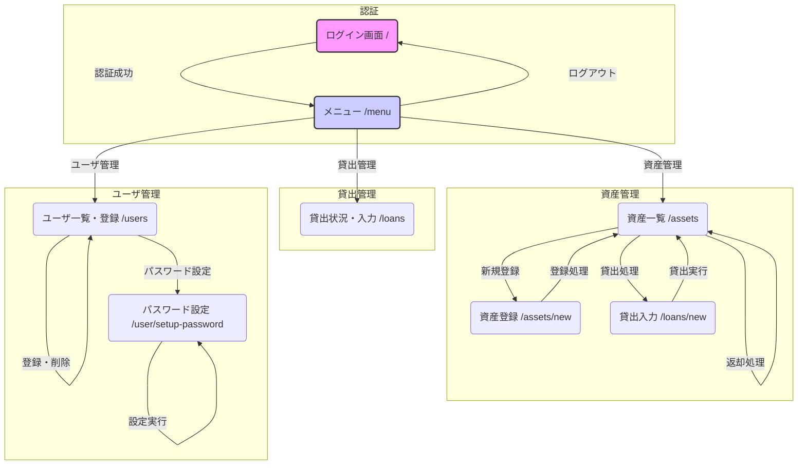

# 画面遷移図

## 遷移の説明

1.  **ログイン画面 (`/`)**: アプリケーションの初期画面。ユーザ名とパスワードを入力してログインする。
    - 認証に成功すると **メニュー画面** に遷移する。
    - 認証に失敗すると、エラーメッセージと共に再度ログイン画面が表示される。

2.  **メニュー画面 (`/menu`)**: ログイン後のトップページ。ここから各機能へアクセスする。
    - `資産管理`、`貸出管理`、`ユーザ管理`へのリンクがある。
    - `ログアウト`ボタンを押すと、セッションが破棄されて **ログイン画面** に戻る。

3.  **資産一覧画面 (`/assets`)**: 登録されている資産を一覧表示する。
    - `新規登録`ボタンから **資産登録画面** に遷移する。
    - `貸出`ボタンから **貸出入力画面** に遷移する。
    - `返却`ボタンを押すと、返却処理が実行され、再度 **資産一覧画面** が表示される。

4.  **資産登録画面 (`/assets/new`)**: 新しい資産を登録する。
    - 登録処理が完了すると **資産一覧画面** にリダイレクトされる。

5.  **貸出状況・入力画面 (`/loans`)**: 現在の貸出状況と、貸出可能な資産、ユーザの一覧が表示される。
    - この画面から直接貸出処理を行うことも可能（UIの実装による）。

6.  **貸出入力画面 (`/loans/new`)**: 誰に何を貸し出すかを選択し、貸出処理を実行する。
    - 貸出処理が完了すると **資産一覧画面** にリダイレクトされる。

7.  **ユーザ一覧・登録画面 (`/users`)**: 登録ユーザの一覧表示と、新規ユーザの登録を行う。
    - ユーザの削除や、管理者への権限変更もこの画面から行う。
    - 処理が完了すると、再度 **ユーザ一覧画面** が表示される。
    - `パスワード設定`ボタンから **パスワード設定画面** に遷移する。

8.  **パスワード設定画面 (`/user/setup-password`)**: 特定ユーザのパスワードを設定・変更する。
    - 処理が完了すると、再度 **パスワード設定画面** が表示される。
