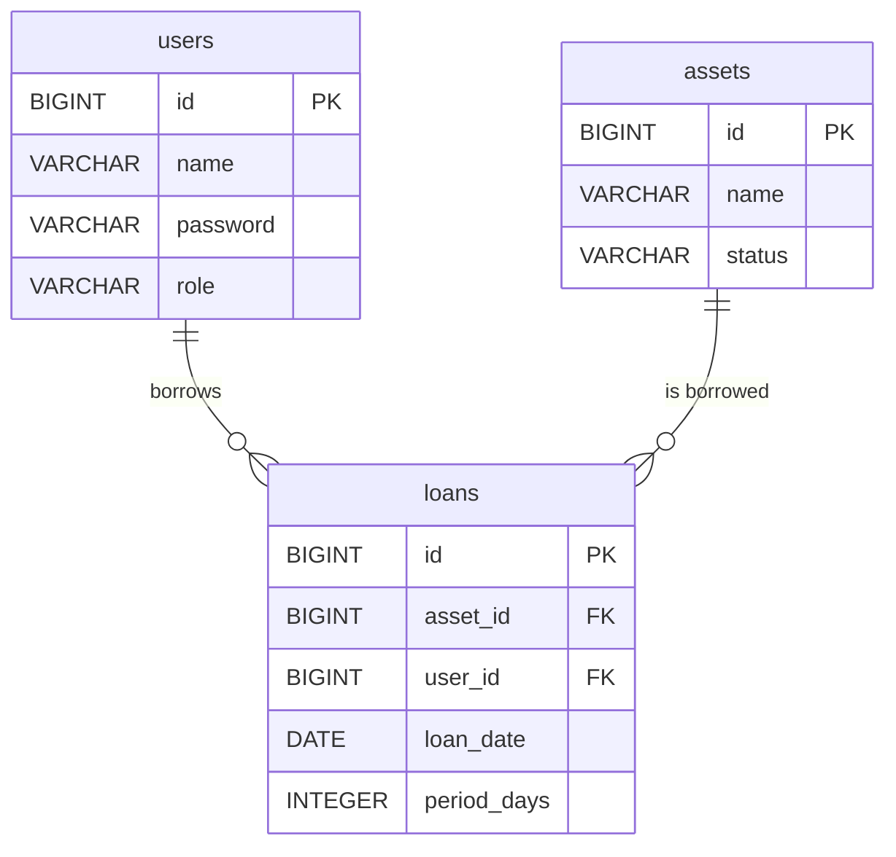

# DB設計

## テーブル定義
### `users` - ユーザ
| カラム名 | 型 | 説明 |
|---|---|---|
| `id` | `BIGINT` (PK) | ユーザID（自動採番） |
| `name` | `VARCHAR(100)`| ユーザ名 |
| `password` | `VARCHAR(100)`| パスワード（ハッシュ化を推奨） |
| `role` | `VARCHAR(20)` | 権限 (`Admin` / `User`) |

### `assets` - 資産
| カラム名 | 型 | 説明 |
|---|---|---|
| `id` | `BIGINT` (PK) | 資産ID（自動採番） |
| `name` | `VARCHAR(100)`| 資産名 |
| `status` | `VARCHAR(20)` | 状態 (`AVAILABLE` / `LOANED`) |

### `loans` - 貸出
| カラム名 | 型 | 説明 |
|---|---|---|
| `id` | `BIGINT` (PK) | 貸出ID（自動採番） |
| `asset_id` | `BIGINT` (FK) | 資産ID (`assets.id`) |
| `user_id` | `BIGINT` (FK) | ユーザID (`users.id`) |
| `loan_date` | `DATE` | 貸出日 |
| `period_days`| `INTEGER` | 貸出期間（日数） |

---

## ER図


---

## スキーマ (`schema.sql`)
開発環境（H2データベース）で使用するテーブル作成SQLです。

```sql
DROP TABLE IF EXISTS loans;
DROP TABLE IF EXISTS assets;
DROP TABLE IF EXISTS users;

CREATE TABLE users (
    id BIGINT AUTO_INCREMENT PRIMARY KEY,
    name VARCHAR(100),
    password VARCHAR(100),
    role VARCHAR(20)
);

CREATE TABLE assets (
    id BIGINT AUTO_INCREMENT PRIMARY KEY,
    name VARCHAR(100),
    status VARCHAR(20)
);

CREATE TABLE loans (
    id BIGINT AUTO_INCREMENT PRIMARY KEY,
    asset_id BIGINT,
    user_id BIGINT,
    loan_date DATE,
    period_days INTEGER,
    CONSTRAINT fk_asset FOREIGN KEY (asset_id) REFERENCES assets(id),
    CONSTRAINT fk_user FOREIGN KEY (user_id) REFERENCES users(id)
);
```
